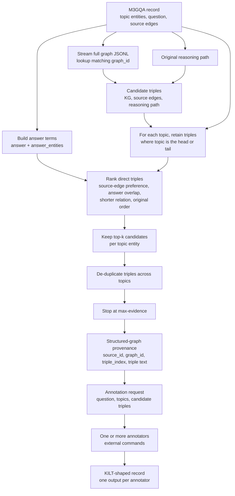

# M3GQA/SynMeS to KILT exporter

This package exports M3GQA/SynMES split records as KILT-shaped JSONL for
multi-entity summarization. It reads only the split files and does not load
`new_graphs.jsonl` into memory.

Each topic entity receives up to `--top-k` direct edges. Candidate triples are
drawn from the source record, its optional `reasoning_path` or
`original_reasoning_path`, and the matching full KG. Duplicate edges are
removed and `--max-evidence` limits the total evidence for one record. Since
the source is a structured graph rather than Wikipedia, provenance uses
`source_id`, `source_type`, and `triple_index` instead of `wikipedia_id`.

## Candidate triple retrieval



The rank first enforces direct topic-entity membership; all remaining rank
signals only order those direct candidates. Supply `--annotator-command` once
per LLM annotator. Each command receives an annotation request as JSON on
standard input and writes one summary to standard output. Without an annotator
command, the exporter retains its single extractive-summary fallback.

## Input contract

Each split JSONL record requires `graph_id`, `question`, `topic_entities`, and
`edges`. An edge is a three-item `[head, relation, tail]` array. To supply the
original reasoning path, use either `reasoning_path` or
`original_reasoning_path`, with the same triple-array format. `answer` and
`answer_entities` are optional ranking hints.

When `--graph-path` is supplied, each full-graph JSONL record must identify
the graph through `id` or `graph_id`, and store triples in `graph` or `edges`.
The exporter streams this file and retains only requested graph IDs.

Candidate triples are de-duplicated in this order: matching full KG, source
edges, then reasoning-path triples. Source edges receive a ranking preference;
answer overlap, shorter relations, and source order break remaining ties.

## Annotation contract

An annotator command reads exactly one JSON object from standard input and
writes the summary text to standard output. The request has this shape:

```json
{
  "question": "Which city connects the entities?",
  "topic_entities": ["Entity A", "Entity B"],
  "candidate_triples": [["Entity A", "related_to", "City X"]],
  "evidence": ["Entity A related to City X."],
  "instruction": "Write a concise multi-entity summary grounded only in the candidate triples."
}
```

The command is executed directly, not through a shell. Quote arguments as one
CLI value when they contain spaces. A command that exits unsuccessfully or
writes an empty summary causes the export to fail.

## Output contract

Each exported KILT-shaped record has one `output` element per annotator
command. Every element contains the annotator's `answer`, the retrieved
structured-graph `provenance`, and `meta.annotator`, which records the command
used. When no annotator command is provided, `output` contains one extractive
answer and `meta.annotator` is `extractive`.

The record-level `meta.candidate_sources` reports the number of source edges,
reasoning-path triples, and full-KG triples available for that example.

From the KILT repository root:

```bash
python3 -m kilt_synmes.pipeline \
  --data-dir /path/to/M3GQA/data \
  --split test \
  --top-k 5 \
  --max-evidence 15 \
  --limit 1 \
  --graph-path /path/to/M3GQA/data/new_graphs.jsonl \
  --output predictions/synmes/test
```

To emit synthetic summaries from two annotation workers, repeat the option:

```bash
python3 -m kilt_synmes.pipeline \
  --data-dir /path/to/M3GQA/data \
  --split test \
  --output predictions/synmes/test \
  --annotator-command "python3 /path/to/annotate.py --model model-a" \
  --annotator-command "python3 /path/to/annotate.py --model model-b"
```
