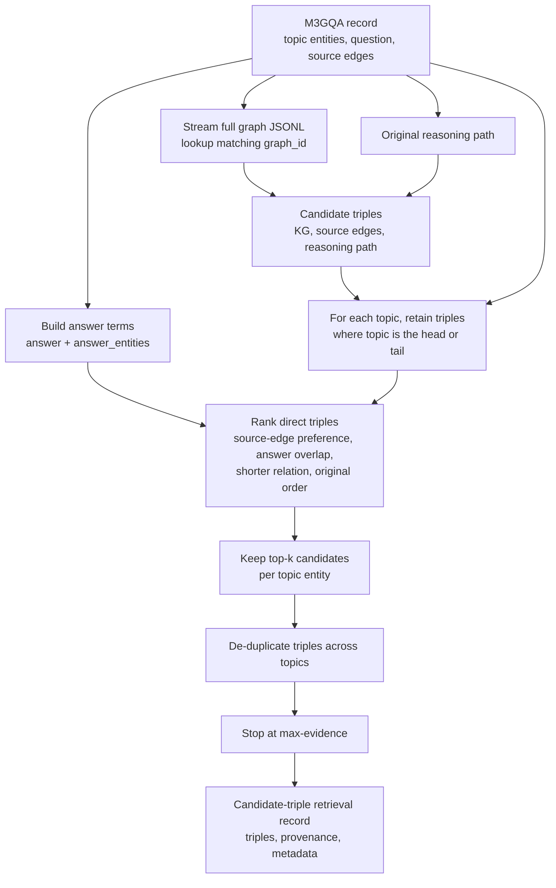

# M3GQA/SynMeS to KILT exporter

This package retrieves candidate triples from M3GQA/SynMES split records. It
reads only the selected split files and does not load `new_graphs.jsonl` into
memory.

Each topic entity receives up to `--top-k` direct edges. Candidate triples are
drawn from the source record, its optional `reasoning_path` or
`original_reasoning_path`, and the matching full KG. Duplicate edges are
removed and `--max-evidence` limits the total evidence for one record. Since
the source is a structured graph rather than Wikipedia, provenance uses
`source_id`, `source_type`, and `triple_index` instead of `wikipedia_id`.

## Candidate triple retrieval



The rank first enforces direct topic-entity membership; all remaining rank
signals only order those direct candidates. The exporter stops after candidate
retrieval and writes one JSON object per source record with `question`,
`candidate_triples`, `provenance`, and retrieval metadata.

## Input contract

Each split JSONL record requires `graph_id`, `question`, `topic_entities`, and
`edges`. An edge is a three-item `[head, relation, tail]` array. To supply the
original reasoning path, use either `reasoning_path` or
`original_reasoning_path`, with the same triple-array format. `answer` and
`answer_entities` are optional ranking hints.

For efficient direct lookup, provide `--graph-dir` for graph files stored as
`<graph-dir>/<split>/<graph_id>.json`. Each graph file must identify the graph
through `id` or `graph_id`, and store triples in `subgraph`, `graph`, or
`edges`. The exporter opens only the files whose IDs appear in the selected
split records. `--graph-path` remains available for a JSONL graph file, which
the exporter must stream to find matching IDs.

Candidate triples are de-duplicated in this order: matching full KG, source
edges, then reasoning-path triples. Source edges receive a ranking preference;
answer overlap, shorter relations, and source order break remaining ties.

## Output contract

Each record contains `id`, `question`, `candidate_triples`, structured-graph
`provenance`, and `meta`. The record-level `meta.candidate_sources` reports the
number of source edges, reasoning-path triples, and full-KG triples available
for that example.

From the KILT repository root:

```bash
python3 -m kilt_synmes.pipeline \
  --data-dir /path/to/M3GQA/data \
  --split test \
  --top-k 5 \
  --max-evidence 15 \
  --limit 1 \
  --graph-dir /path/to/M3GQA/data/graphs \
  --output predictions/synmes/retrieval
```
