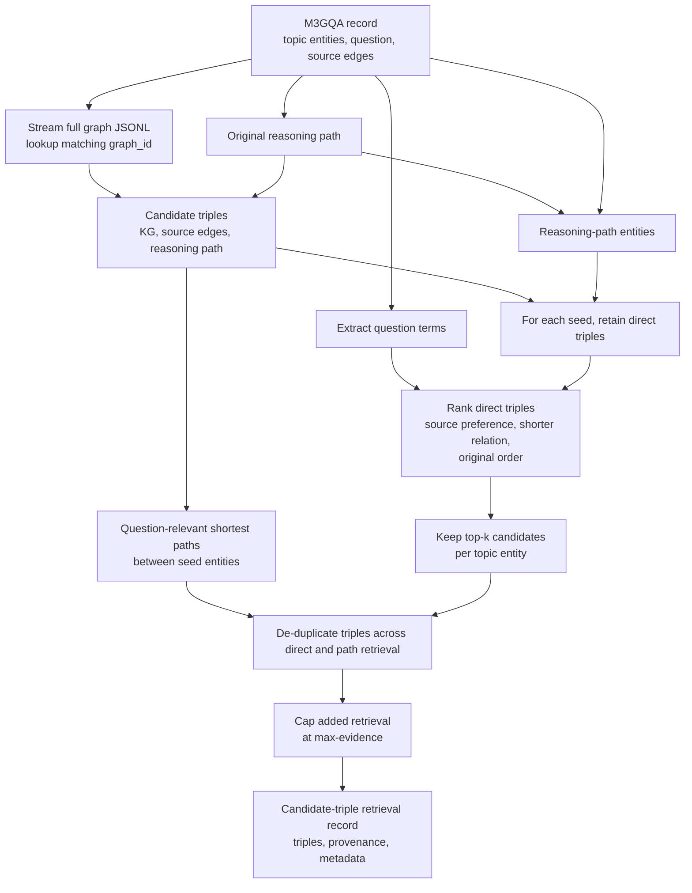

# M3GQA/SynMeS to KILT exporter

This package retrieves candidate triples from M3GQA/SynMES split records. It
reads only the selected split files and does not load `new_graphs.jsonl` into
memory.

Provided `reasoning_path` and source `edges` triples are retained first. The
retriever then adds up to `--top-k` direct edges from topic and reasoning-path
entities, followed
by shortest paths of up to `--max-hops` edges that connect those seed entities
and overlap the question context. Candidate triples are drawn from the source
record, its optional `reasoning_path` or `original_reasoning_path`, and the
matching full KG. Duplicate edges are removed and `--max-evidence` limits only
additional retrieved triples; it never removes provided source or reasoning-path
evidence. Since the source is a structured graph rather than Wikipedia,
provenance uses `source_id`, `source_type`, and `triple_index` instead of
`wikipedia_id`.

## Candidate triple retrieval



The rank first enforces direct seed-entity membership; all remaining rank
signals only order those direct candidates. Multi-hop expansion uses bounded
breadth-first search and returns only the first shortest path found for each
seed. A path is retained only when one of its triples has lexical overlap with
the question; `--max-hops` defaults to `3`. The exporter does not use `answer`
or `answer_entities` for retrieval, avoiding target leakage.

Use `unlimited` for `--top-k` or `--max-evidence` to remove that limit. This is
useful for inspection, but can create large and noisy retrieval records. The
evidence limit applies only to added direct and multi-hop triples; source and
reasoning-path triples are always preserved.

## Input contract

Each split JSONL record requires `graph_id`, `question`, `topic_entities`, and
`edges`. An edge is a three-item `[head, relation, tail]` array. To supply the
original reasoning path, use either `reasoning_path` or
`original_reasoning_path`, with the same triple-array format. `answer` and
`answer_entities` are optional ranking hints.

For efficient direct lookup, provide `--graph-dir` for graph files stored as
`<graph-dir>/<split>/<graph_id>.json`. Each graph file must identify the graph
through `id` or `graph_id`, and store triples in `subgraph`, `graph`, or
`edges`. The exporter opens only the files whose IDs appear in the selected
split records. `--graph-path` remains available for a JSONL graph file, which
the exporter must stream to find matching IDs.

Candidate triples are de-duplicated in this order: reasoning path, source edges,
then added full-KG retrieval. Source and reasoning-path triples are always
retained; source priority, shorter relations, and source order rank direct
retrieval additions.

## Output contract

Each record contains `id`, `question`, `candidate_triples`, structured-graph
`provenance`, and `meta`. The record-level metadata reports the available
source counts plus `source_evidence_count` and `retrieved_evidence_count`.

From the KILT repository root:

```bash
python3 -m kilt_synmes.pipeline \
  --data-dir /path/to/M3GQA/data \
  --split test \
  --top-k 5 \
  --max-evidence 15 \
  --max-hops 3 \
  --limit 1 \
  --graph-dir /path/to/M3GQA/data/graphs \
  --output predictions/synmes/retrieval
```

To retain every direct triple and remove the total evidence cap:

```bash
python3 -m kilt_synmes.pipeline \
  --data-dir /path/to/M3GQA/data \
  --split test \
  --top-k unlimited \
  --max-evidence unlimited \
  --graph-dir /path/to/M3GQA/data/graphs \
  --output predictions/synmes/retrieval-unlimited
```

## HTML visualization

Render any retrieval record as a self-contained HTML knowledge graph:

```bash
python3 -m kilt_synmes.visualize \
  --input predictions/synmes/retrieval/aggregation_setting.jsonl \
  --record-index 0 \
  --output predictions/synmes/retrieval/aggregation_setting.html
```
